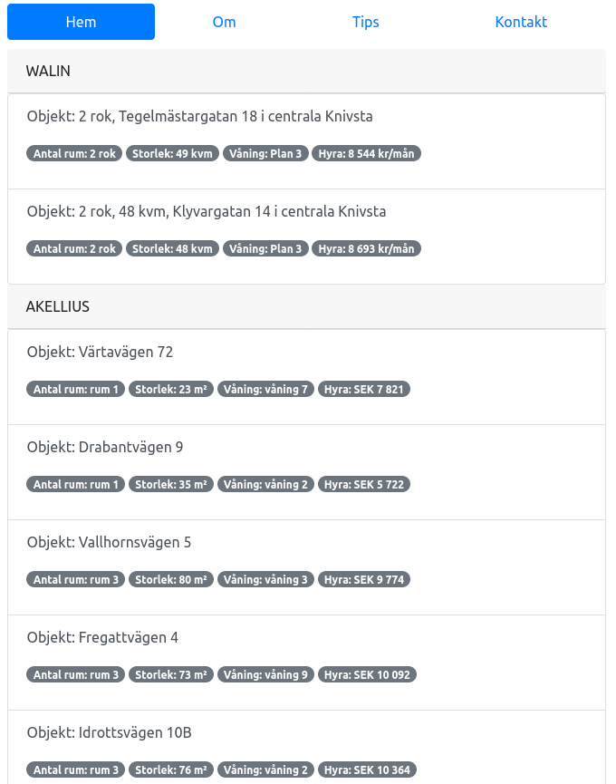

## Vad är Bostadsök?
Detta är ett python project med Django. Ville bekanta mig med frontend och backend programmering. Gjorde då en enkel bostadssökare som tittar på lediga lägenheter hos följande hyresvärdar:
* Hässelbyhem
* Heba
* Wålinfastigheter
* Wäsbyhem
* Akelius

## Hur kan jag vidareutveckla det här projektet?
* Klona ner repot
* Ha Django installerat på din burk (Python3.7 kör jag)
* Vill du starta servern och allt:

        cd Bostadnsok/
        python3 manage.py runserver
* Gå in på https://127.0.01:8000. Där finns dina lägenheter.

## Planer
Om jag kommer på några andra hyresvärdar så kan jag lägga till dem också. Källkoden finns här. Vill du hosta det på din egen server så var så god. Vill du ändra något så klona och ändra. :)
Följande är en snapshot av sidan.

