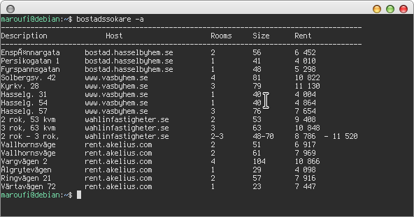

# Vad är Bostadsök?
En applikation som hittar senaste först-till-kvarn lägenheter i Stockholm. Detta består av två delar:
+ Backend som också finns i .deb paketeringsformat för Linux-användare
+ Fronted och backend för de som vil hosta den på sin egen server.Denna del är gjord i Python och Django med html och css samt Bootstrap.

Jag började med det här projektet för jag sökte lägenhet och ville lära mig Django. Appen kollar lediga lägenheter hos följande hyresvärdar:
* Hässelbyhem (sedan version 0.1.0)
* Heba (sedan version 0.1.0)
* Wålinfastigheter (sedan version 0.1.0)
* Wäsbyhem (sedan version 0.1.0)
* Akelius (sedan version 0.1.0)
* Ikano Bostäder (sedan version 0.1.1)

## Terminal applikation
1. Ladda hem bostadsokare_0.1.1-1_all.deb. Filen hittas under Releases/

`Checksum: 2e71f25193689eae5b0042dbf05fcd06`

2. Öppna ett terminalfönster och skriv:

`sudo dkpg -i bostadsokare_0.1.1-1_all.deb`

3. Go in nu på ett terminalfönster och skriv:

`bostadssokare -a       # Visar all tillgängliga lägenheter.`

`bostadssokare -l 1     # Visar all tillgängliga lägenheter hos Akelius.`

`bostadssokare -h       # Visar hur applikationen skall användas.`

## Backend-Frontend
* Klona ner repot
* Ha Django installerat på din burk (Python3.7 kör jag)
* Vill du starta servern och allt:

`cd Bostadsok/`

`python3 manage.py runserver`

* Gå in på https://127.0.01:8000. Där finns dina lägenheter.

---
## Planer
Om jag kommer på några andra hyresvärdar så kan jag lägga till dem också. Källkoden finns här. Vill du hosta det på din egen server så var så god. Vill du ändra något så klona och ändra. :)
Följande är en snapshot av sidan.

